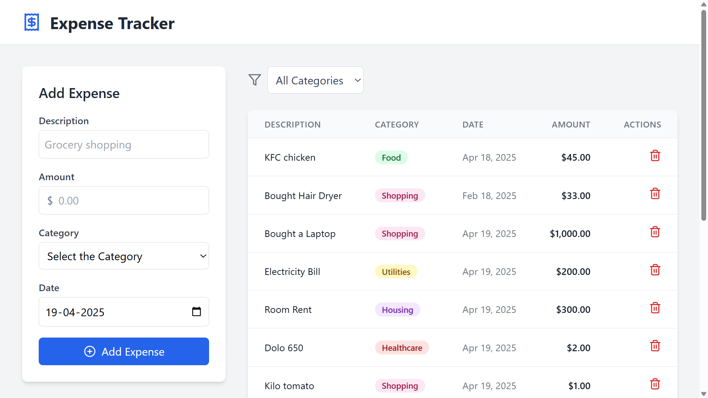
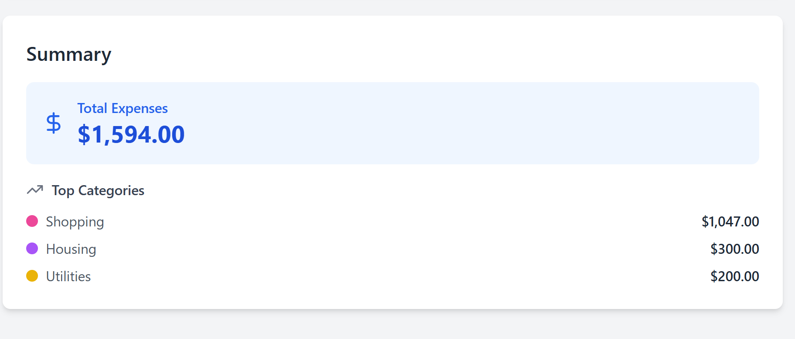

# Smart Expense Tracker 💸

Smart Expense Tracker is a full-stack web application built to help users manage their expenses efficiently. Developed using **Java 17**, **Spring Boot**, **React**, and deployed with **Docker**, **Netlify**, and **Render**, this project showcases modern web development and deployment practices. 🚀

## Features ✨

- Track income and expenses with a clean, user-friendly interface.
- Categorize transactions for better financial insights.
- RESTful APIs for seamless backend-frontend communication.
- Responsive design powered by React and styled with Tailwind CSS.
- Containerized backend with Docker for easy deployment.

## Tech Stack 🛠️

- **Frontend**: React, Tailwind CSS, deployed on [Netlify](https://www.netlify.com/)
- **Backend**: Java 17, Spring Boot, deployed on [Render](https://render.com/)
- **Containerization**: Docker, hosted on [Docker Hub](https://hub.docker.com/)
- **Database**: PostgreSQL
- **Tools**: Git, Maven, Node.js

## Project Setup and Installation ⚙️

### Prerequisites

- Node.js (v16+)
- Java 17
- Docker
- Maven

### Steps to Run Locally

1. **Clone the Repository**:

   ```bash
   git clone https://github.com/sreenathapps/smart-expense-tracker.git
   cd smart-expense-tracker
   ```

2. **Backend Setup**:

   - Navigate to the backend folder:
     ```bash
     cd backend
     mvn clean install
     mvn spring-boot:run
     ```
   - The backend will run on `http://localhost:8080`.

3. **Frontend Setup**:

   - Navigate to the frontend folder:
     ```bash
     cd frontend
     npm install
     npm run dev
     ```
   - The frontend will run on `http://localhost:5173`.

4. **Docker Setup**:
   - Pull the Docker image from Docker Hub:
     ```bash
     docker pull saisreenathm/expense-tracker:latest
     ```
   - Run the container:
     ```bash
     docker run --env-file .env -p 8080:8080 saisreenathm/expense-tracker:latest
     ```

## Deployment 🚀

- **Frontend**: Deployed on Netlify at [ai-smart-expense-tracker.netlify.app](https://ai-smart-expense-tracker.netlify.app/).
- **Backend**: Dockerized and deployed on Render using the public Docker Hub image: `saisreenathm/expense-tracker:latest`.
- **Live Demo**: https://ai-smart-expense-tracker.netlify.app/

## Screenshots 📸




## Future Enhancements 🔮

- Add user authentication with JWT.
- Implement advanced analytics for spending patterns.

## Contributing 🤝

Contributions are welcome! Please fork the repo, create a new branch, and submit a pull request.

## Contact 📬

For queries, reach out via [LinkedIn](https://www.linkedin.com/in/saisreenath-mandaloju) or email: saisreenath.mandaloju@gmail.com.

#Java #SpringBoot #React #Docker #FullStack #WebDevelopment
